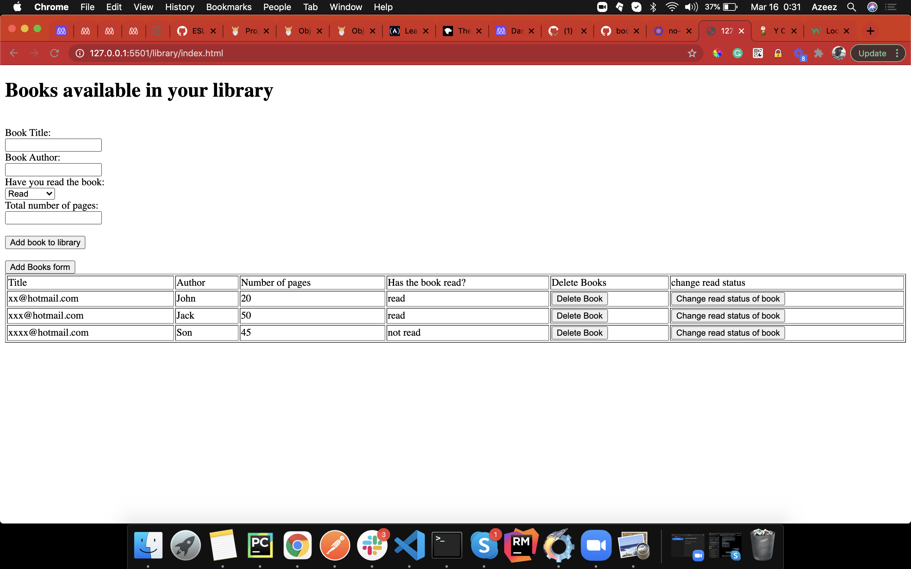

# Book Library

## Screenshot

## Description

A simple JS based App for a Book Library Record.

## Setup
- Clone the project by running `git clone https://github.com/kunmi02/library.git` on terminal or CMD
- Run terminal or CMD from the project directory.
- Run `npm install` if linters are required.
- Run index.html in your Web Browser.

## Built With

- HTML 
- CSS
- Linter
- JS
- VScode

## Demo Link

no live demo available yet

## Contributing

Contributions, issues and feature requests are welcome! Start by:

  - Forking the project
  - Cloning the project to your local machine
  - cd into the project directory
  - Run git checkout -b your-branch-name
  - Make your contributions
  - Push your branch up to your forked repository
  - Open a Pull Request with a detailed description to the development branch of the original project for a review

## Author

👤 Azeez Ibrahim
Github: [@kunmi02](https://github.com/kunmi02)

## Show your Support
Give a ⭐ if you like this project!
